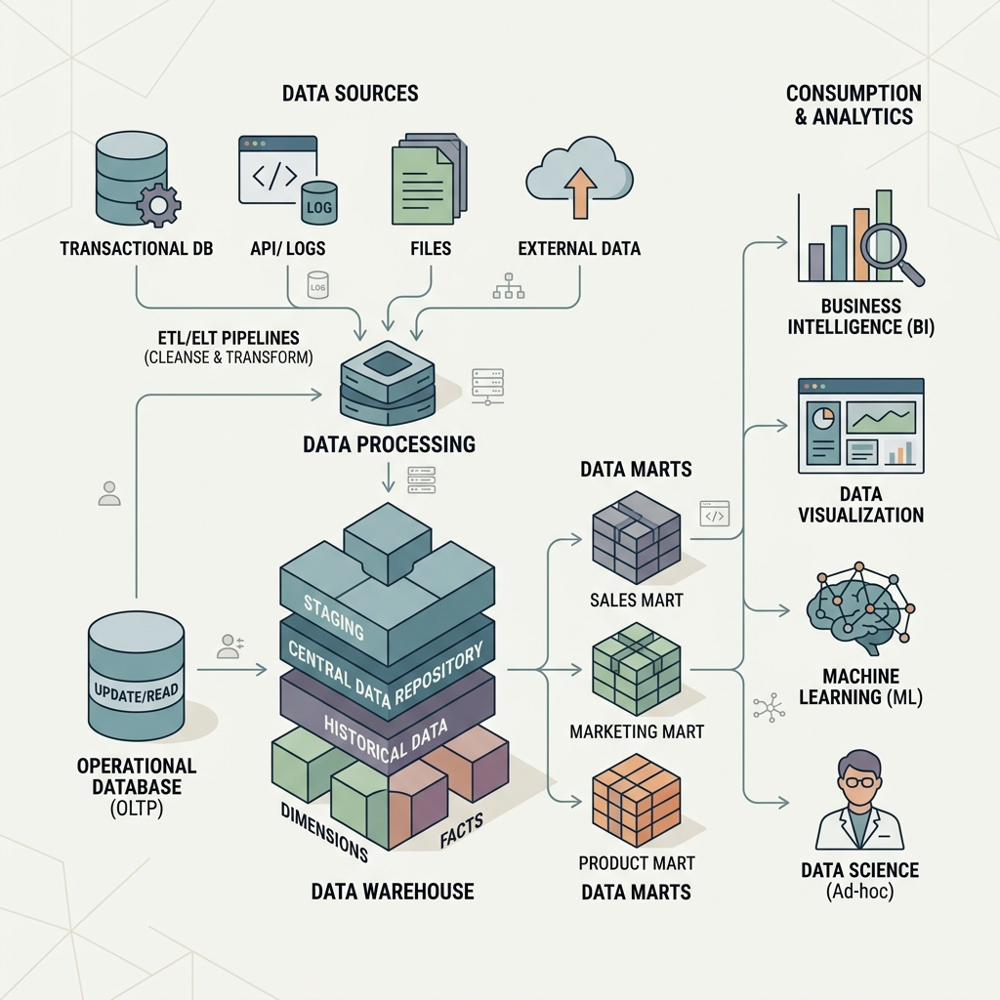
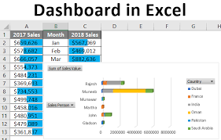
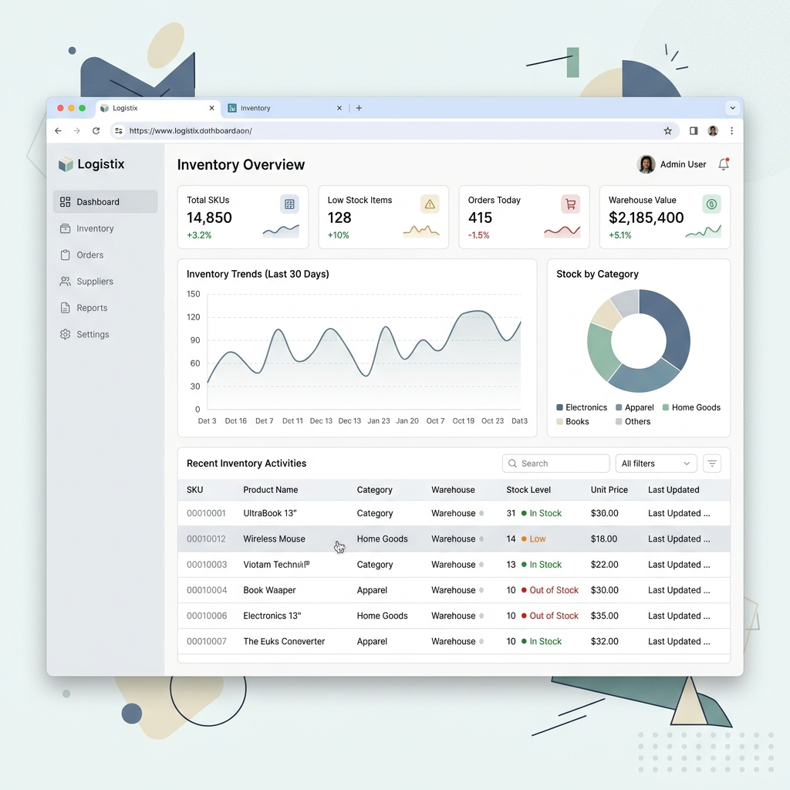
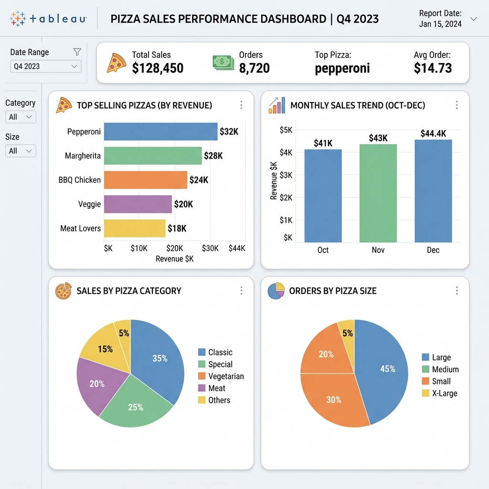

# Bandhan Hardiya - Portfolio Website

Welcome to the repository for my personal portfolio website! This project is a minimalist, responsive, and dynamic portfolio built to showcase my skills, projects, and certifications as an aspiring Data Analyst and Software Developer.

## 🚀 Overview

This website serves as my digital resume and project showcase. It highlights my expertise in data analytics, software development, and various tools like SQL, Python, Power BI, Tableau, and Excel.

### Key Features
- **Modern & Minimalist Design**: Clean UI with a focus on content and readability.
- **Dark/Light Mode**: Fully functional theme toggle for user preference.
- **Dynamic Typing Effect**: Engaging hero section animation.
- **Responsive Layout**: Optimized for desktop, tablet, and mobile devices.
- **GitHub Integration**: Automatically fetches and displays my latest open-source repositories.
- **Project Showcase**: Detailed views of my data analytics and software development projects.

## 🖼️ Visuals & Projects

Here is a glimpse of me and some of the projects featured in my portfolio:

### Profile

### Projects

**Data Warehouse Project**

**Excel Dashboard**

**Inventory Management**

**Pizza Sales Analysis**

## 🎓 Certifications

The portfolio also highlights my professional certifications from Google and IBM, which include:
- Google Data Analytics Professional Certificate
- IBM Python for Data Science, AI & Development
- Various specialized courses in data preparation and decision making.

*(You can view the full list and certificates in the `assets/` folder or on the live website)*

## 🛠️ Technology Stack

- **HTML5**: Semantic structure and content.
- **CSS3**: Vanilla CSS for styling, responsive design (Flexbox/Grid), and animations.
- **JavaScript (ES6)**: Logic for theme toggling, typing effects, fetching GitHub repos, and mobile navigation.

## 📁 Repository Structure

- `index.html` - Home page with hero section and dynamic GitHub repos.
- `about.html` - Information about my background, skills, and education.
- `work.html` - Detailed breakdown of my data analysis and software projects.
- `certifications.html` - Showcase of my earned certificates.
- `contact.html` - Functional contact form and social links.
- `style.css` - Main stylesheet containing all design tokens and responsive queries.
- `script.js` - Client-side logic and API integrations.
- `assets/` - Directory containing images, project screenshots, certificates, and my resume.

## 🤝 Let's Connect

Feel free to reach out if you'd like to discuss data analytics, software development, or potential opportunities!

- **Email**: [Through Contact Form]
- **LinkedIn**: [Link on Website]
- **GitHub**: [Link on Website]

---
*Built with ❤️ by Bandhan Hardiya.*
